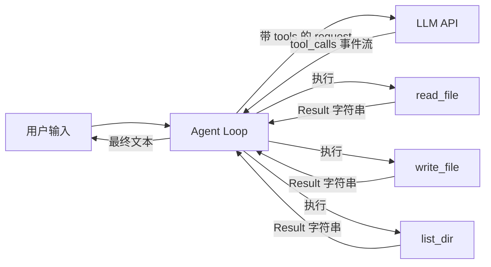

# agent-learning-journey

手搓一个 AI Agent 的记录

##  v1 能做什么
- 和你多轮对话
- 读写沙盒内文件（./sandbox 目录）
- 流式输出 + Ctrl+C 中断
- 工具错误不崩溃

## 架构（v1）


## 快速开始
```bash
pnpm install
cp .env.example .env   # 填入 API key
pnpm tsx src/cli.ts
```

支持的 Provider: DeepSeek（主力）/ OpenAI / Gemini（只需改 `LLM_PROVIDER`）

## Demo


## 学习笔记
每日笔记见 `notes/`，周总结见 `notes/week*-summary.md`。

## Roadmap
- [x] v1: while 循环 + 文件工具 + 流式 + Abort
- [ ] v2: Tools 抽象（Zod） + Memory（短+长） + Planning
- [ ] v3: 集成 pi-mono 的 compact 机制 + MCP
- [ ] v4: 综合项目
````